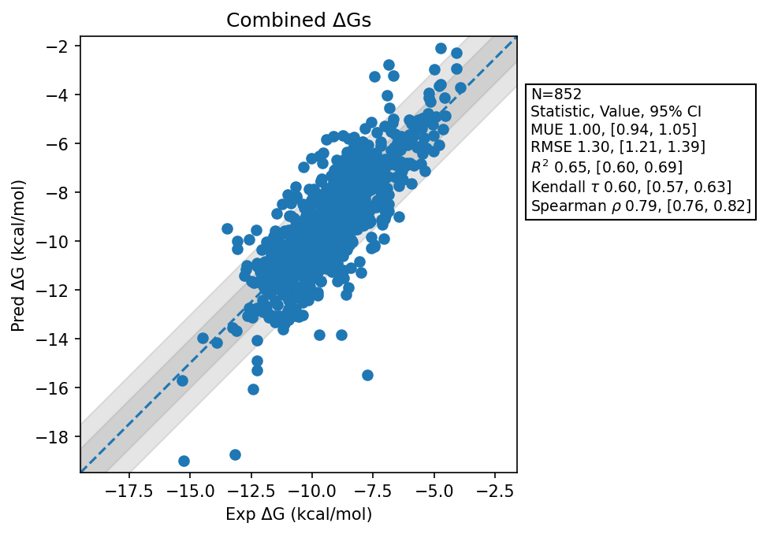

# Summary Dec 28 2025
- Number of Datasets: 53
- Number of Ligands: 854
- Number of Edges: 1502
- Total Wallclock Time: 233.87 Hours
- Average Time Per Edge: 0.16 Hours
- TMD Sha: [be54a617e0ca39fba04baa293394cc65f12327f5](https://github.com/tmd-industries/tmd/tree/be54a617e0ca39fba04baa293394cc65f12327f5)

## Notes:
- Switches to using the same inputs as OpenFE
- Added plots comparing against OpenFE predictions. Note that not all compounds could be matched, so the compounds may be a subset the dataset. OpenFE data taken from [here](https://github.com/OpenFreeEnergy/IndustryBenchmarks2024/blob/ff41e5ad0fda89b352341e3f6511bee25db0000a/industry_benchmarks/analysis/processed_results/combined_pymbar3_calculated_dg_data.csv)
