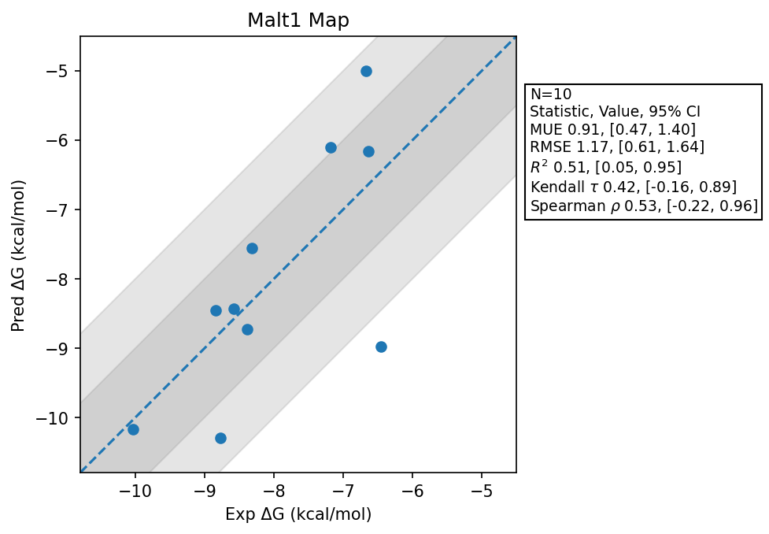

# Malt1 Map

## Statistics Summary
- MUE: 0.91
- RMSE: 1.17
- R²: 0.51
- Kendall 𝜏: 0.42
- Spearman ρ: 0.53

## System Details
- Ligands: 10
- Host Atoms: 6224
- Map Details:
  - Edges: 17
  - Min Dummy Atoms: 3
  - Max Dummy Atoms: 14
  - Mean Dummy Atoms: 8.0
  - Median Dummy Atoms: 9.0

## Simulation Details
- TMD Sha: [be54a617e0ca39fba04baa293394cc65f12327f5](https://github.com/tmd-industries/tmd/tree/be54a617e0ca39fba04baa293394cc65f12327f5)
- GPU: RTX 5090, RTX 5080
- MPS Processes: 12
- Total Wallclock Time: 2.99 Hours
- Total Nanoseconds Simulated: 2100.00
- TMD Forcefield: smirnoff_2_0_0_amber_am1bcc.py
- Ligand Charges: Amber AM1BCC ELF10
- Simulation Details:
  - Seed: 9128
  - Equilibration Steps: 200000
  - Steps Per Frame: 400
  - Production Ns: 2
  - Target Overlap: 0.667
  - Water Sampling: True
  - REST: Temperature Scale 3.0
  - Local MD: Steps 390, Radius 1.2
