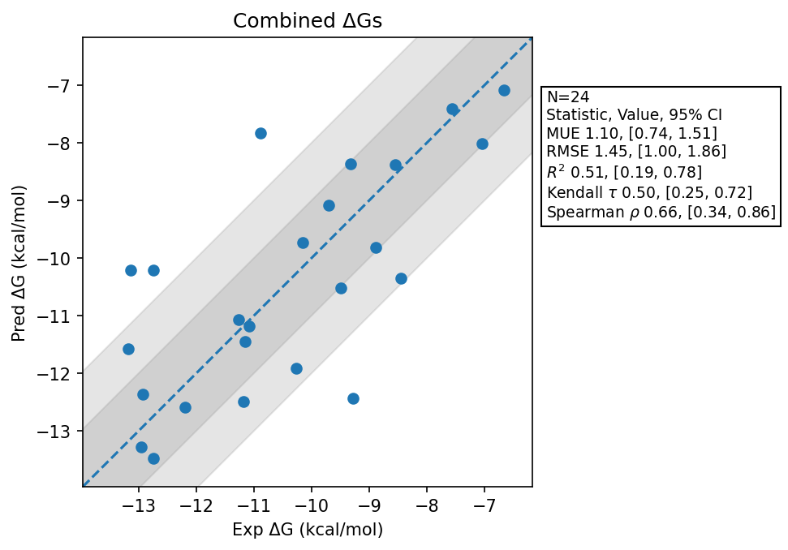

# Summary 2026 Apr 22
- Number of Datasets: 4
- Number of Ligands: 24
- Number of Edges: 38
- Total Wallclock Time: 10.96 Hours
- Average Time Per Edge: 0.29 Hours
- TMD Sha: [4a502e5c9bd790faf3166193240a2d0abd78c75b](https://github.com/tmd-industries/tmd/tree/4a502e5c9bd790faf3166193240a2d0abd78c75b)

## Description
Results for the Schrodinger macrocycle datasets. The default REST regions may be impacting performance of Macrocycles.

