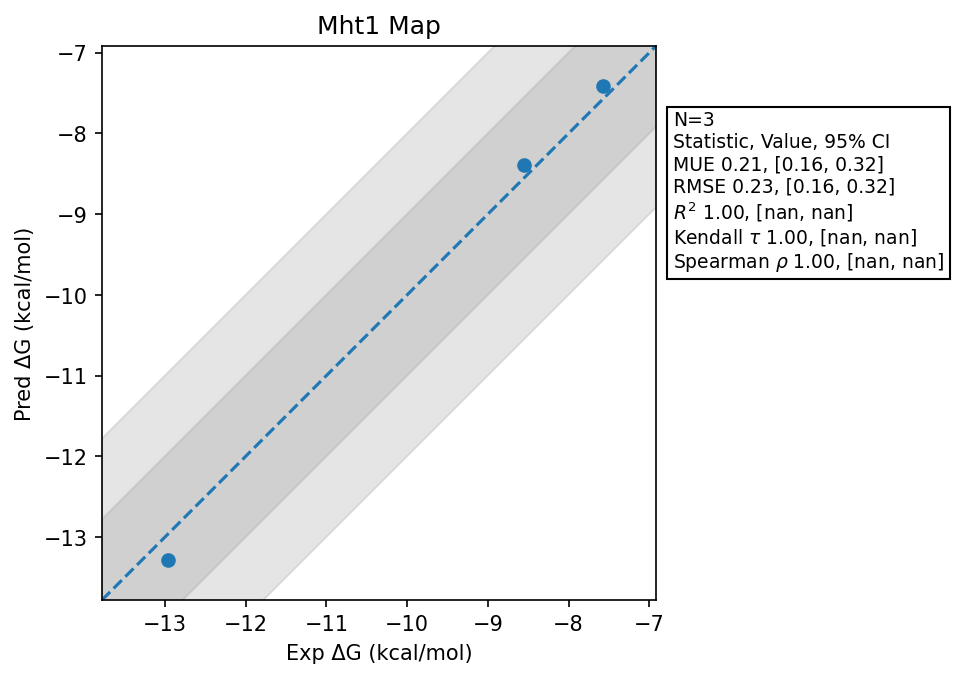

# Mht1 Map

## Statistics Summary
- MUE: 0.21
- RMSE: 0.23
- R²: 1.00
- Kendall 𝜏: 1.00
- Spearman ρ: 1.00

## System Details
- Ligands: 3
- Host Atoms: 2487
- Map Details:
  - Edges: 3
  - Min Dummy Atoms: 5
  - Max Dummy Atoms: 19
  - Mean Dummy Atoms: 12.7
  - Median Dummy Atoms: 14.0

## Simulation Details
- TMD Sha: [4a502e5c9bd790faf3166193240a2d0abd78c75b](https://github.com/tmd-industries/tmd/tree/4a502e5c9bd790faf3166193240a2d0abd78c75b)
- GPU: RTX 5090
- MPS Processes: 2
- Batch Mode: True
- Total Wallclock Time: 0.52 Hours
- Average Time Per Edge: 0.17 Hours
- Total Nanoseconds Simulated: 396.40
- TMD Forcefield: smirnoff_2_0_0_amber_am1bcc.py
- Ligand Charges: Amber AM1BCC ELF10
- Simulation Details:
  - Seed: 421
  - Equilibration Steps: 200000
  - Steps Per Frame: 400
  - Production Ns: 2
  - Target Overlap: 0.667
  - Water Sampling: True
  - REST: Temperature Scale 3.0
  - Local MD: Steps 390, Radius 1.2
