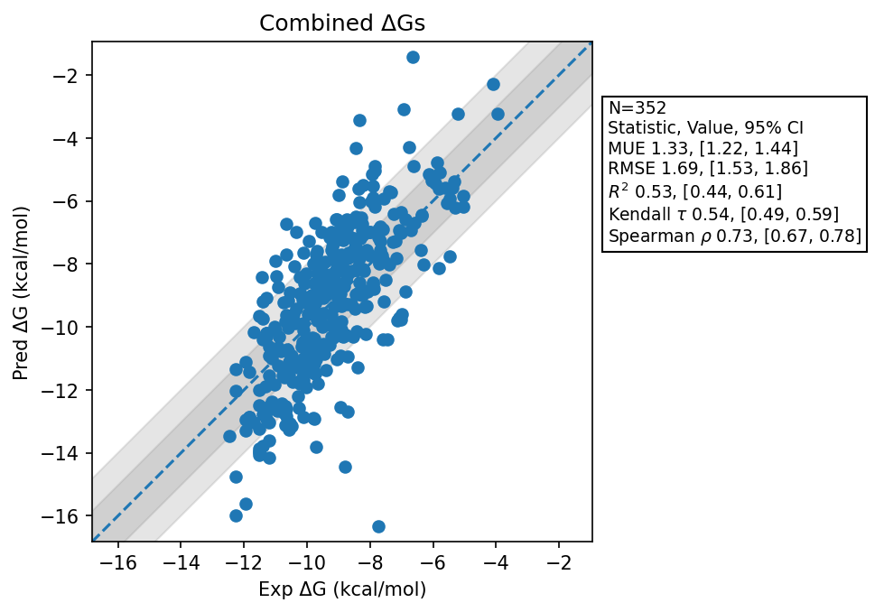

# Summary 
- Number of Datasets: 14
- Number of Ligands: 353
- Number of Edges: 607
- Total Wallclock Time: 83.73 Hours
- Average Time Per Edge: 0.14 Hours
- TMD Sha: [3807bc3316f1fc03f6fb7e120b900339116f2427](https://github.com/tmd-industries/tmd/tree/3807bc3316f1fc03f6fb7e120b900339116f2427)

## Description
Results of switching to Reaction Field from the custom real space PME implementation inherited from Timemachine.

