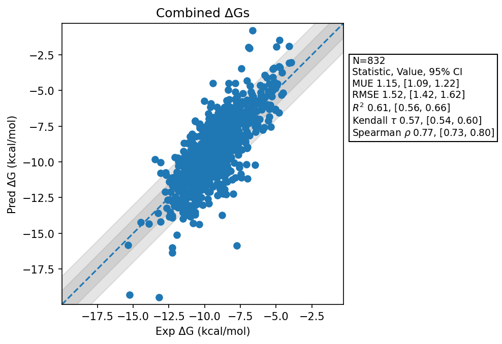

# Summary 2026 Apr 4
- Number of Datasets: 51
- Number of Ligands: 840
- Number of Edges: 1421
- Total Wallclock Time: 550.23 Hours
- Average Time Per Edge: 0.39 Hours
- TMD Sha: [3807bc3316f1fc03f6fb7e120b900339116f2427](https://github.com/tmd-industries/tmd/tree/3807bc3316f1fc03f6fb7e120b900339116f2427)

## Description
Changes to use the new maps with heavy matches heavy modification introduced in https://github.com/tmd-industries/tmd/pull/83

