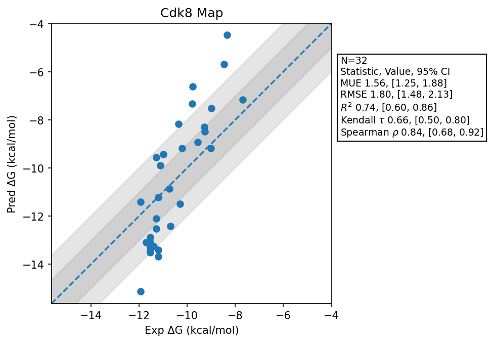

# Cdk8 Map

## Statistics Summary
- MUE: 1.56
- RMSE: 1.80
- R²: 0.74
- Kendall 𝜏: 0.66
- Spearman ρ: 0.84

## System Details
- Ligands: 32
- Host Atoms: 11038
- Map Details:
  - Edges: 57
  - Min Dummy Atoms: 1
  - Max Dummy Atoms: 20
  - Mean Dummy Atoms: 10.7
  - Median Dummy Atoms: 10.0

## Simulation Details
- TMD Sha: [3807bc3316f1fc03f6fb7e120b900339116f2427](https://github.com/tmd-industries/tmd/tree/3807bc3316f1fc03f6fb7e120b900339116f2427)
- GPU: RTX 4090
- MPS Processes: 1
- Batch Mode: True
- Total Wallclock Time: 47.28 Hours
- Average Time Per Edge: 0.83 Hours
- Total Nanoseconds Simulated: 8462.40
- TMD Forcefield: smirnoff_2_0_0_amber_am1bcc.py
- Ligand Charges: Amber AM1BCC ELF10
- Simulation Details:
  - Seed: 4589
  - Equilibration Steps: 200000
  - Steps Per Frame: 400
  - Production Ns: 2
  - Target Overlap: 0.667
  - Water Sampling: True
  - REST: Temperature Scale 3.0
  - Local MD: Steps 390, Radius 1.2
