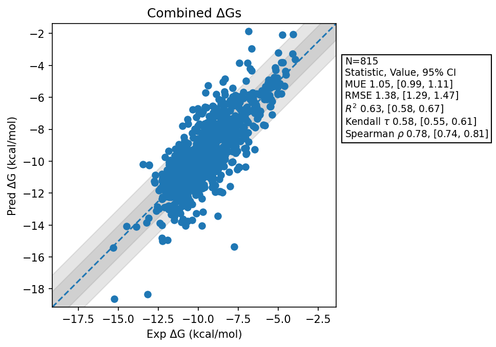

# Summary 
- Number of Datasets: 49
- Number of Ligands: 817
- Number of Edges: 1380
- Total Wallclock Time: 164.35 Hours
- Average Time Per Edge: 0.12 Hours
- TMD Sha: [b6fbbb7d2cbfc8e9c5e14c767131c7183da0bcf4](https://github.com/tmd-industries/tmd/tree/b6fbbb7d2cbfc8e9c5e14c767131c7183da0bcf4)

## Notes:
- Reprepared OpenFE datasets. Some datasets have clashes in the protein structures and failed.
