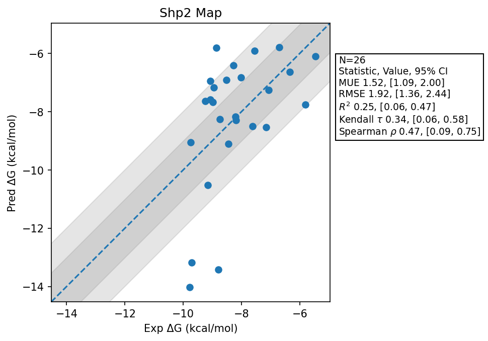

# Shp2 Map

## Statistics Summary
- MUE: 1.52
- RMSE: 1.92
- R²: 0.25
- Kendall 𝜏: 0.34
- Spearman ρ: 0.47

## System Details
- Ligands: 26
- Host Atoms: 8422
- Map Details:
  - Edges: 46
  - Min Dummy Atoms: 1
  - Max Dummy Atoms: 27
  - Mean Dummy Atoms: 7.8
  - Median Dummy Atoms: 6.0

## Simulation Details
- TMD Sha: [b6fbbb7d2cbfc8e9c5e14c767131c7183da0bcf4](https://github.com/tmd-industries/tmd/tree/b6fbbb7d2cbfc8e9c5e14c767131c7183da0bcf4)
- GPU: RTX 5090, RTX 5080
- MPS Processes: 12
- Total Wallclock Time: 6.32 Hours
- Average Time Per Edge: 0.14 Hours
- Total Nanoseconds Simulated: 5071.20
- TMD Forcefield: smirnoff_2_0_0_amber_am1bcc.py
- Ligand Charges: Amber AM1BCC ELF10
- Simulation Details:
  - Seed: 411
  - Equilibration Steps: 200000
  - Steps Per Frame: 400
  - Production Ns: 2
  - Target Overlap: 0.667
  - Water Sampling: True
  - REST: Temperature Scale 3.0
  - Local MD: Steps 390, Radius 1.2
