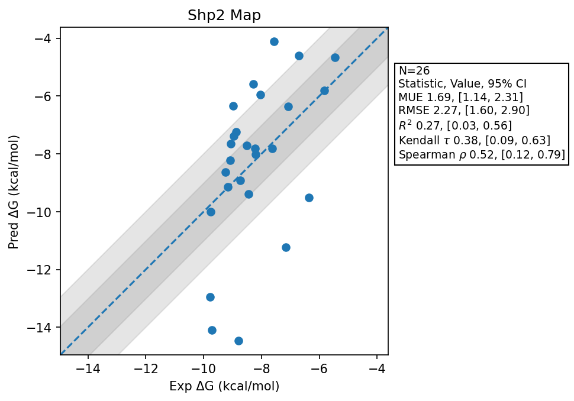

# Shp2 Map

## Statistics Summary
- MUE: 1.69
- RMSE: 2.27
- R²: 0.27
- Kendall 𝜏: 0.38
- Spearman ρ: 0.52

## System Details
- Ligands: 26
- Host Atoms: 8365
- Map Details:
  - Edges: 46
  - Min Dummy Atoms: 1
  - Max Dummy Atoms: 27
  - Mean Dummy Atoms: 7.8
  - Median Dummy Atoms: 6.0

## Simulation Details
- TMD Sha: [be54a617e0ca39fba04baa293394cc65f12327f5](https://github.com/tmd-industries/tmd/tree/be54a617e0ca39fba04baa293394cc65f12327f5)
- GPU: RTX 4090
- MPS Processes: 12
- Total Wallclock Time: 13.96 Hours
- Average Time Per Edge: 0.30 Hours
- Total Nanoseconds Simulated: 5065.40
- TMD Forcefield: smirnoff_2_0_0_amber_am1bcc.py
- Ligand Charges: Amber AM1BCC ELF10
- Simulation Details:
  - Seed: 614943
  - Equilibration Steps: 200000
  - Steps Per Frame: 400
  - Production Ns: 2
  - Target Overlap: 0.667
  - Water Sampling: True
  - REST: Temperature Scale 3.0
  - Local MD: Steps 390, Radius 1.2
