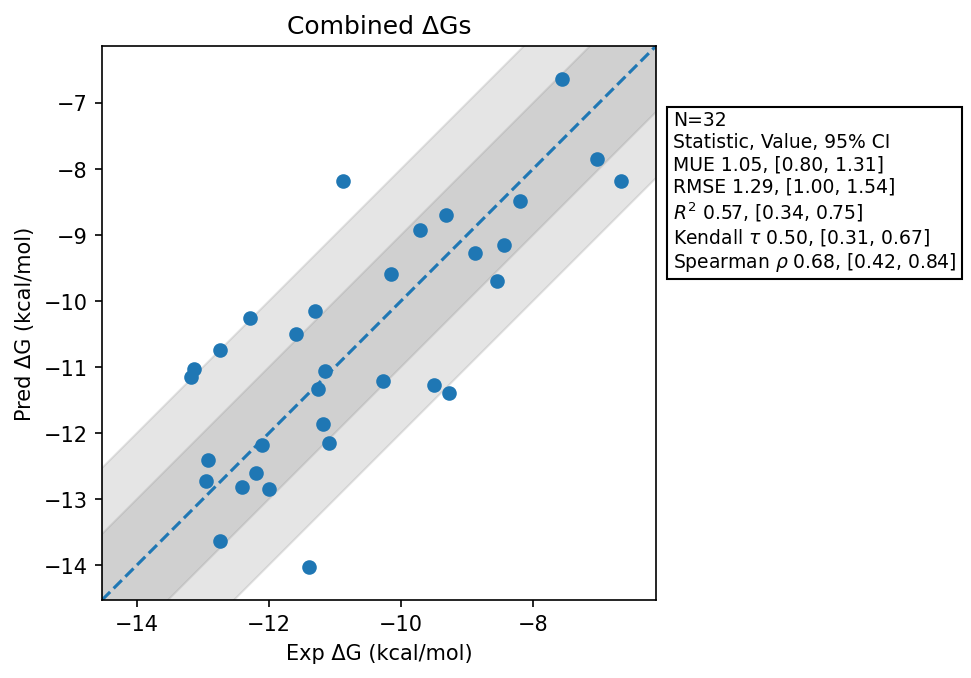

# Summary 
- Number of Datasets: 6
- Number of Ligands: 32
- Number of Edges: 49
- Total Wallclock Time: 32.46 Hours
- Average Time Per Edge: 0.66 Hours
- TMD Sha: [https://github.com/tmd-industries/tmd/pull/132/commits/2651d87e17c5e18fe8f0dc9c26a7007c2c730053](https://github.com/tmd-industries/tmd/tree/https://github.com/tmd-industries/tmd/pull/132/commits/2651d87e17c5e18fe8f0dc9c26a7007c2c730053)

## Description
Evaluates the change to REST that excludes Macrocyclic rings (larger than 7 atom cycles) from the REST region expansion (https://github.com/tmd-industries/tmd/pull/132). This was lead to too much sampling in some cases.

