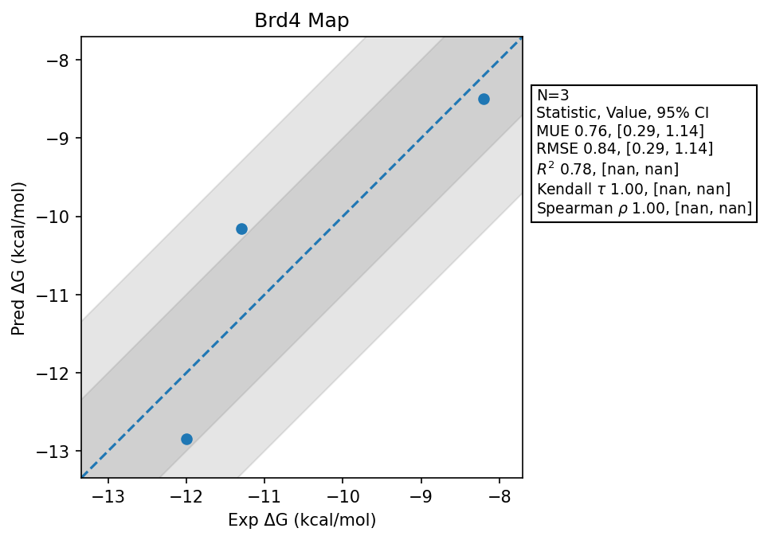

# Brd4 Map

## Statistics Summary
- MUE: 0.76
- RMSE: 0.84
- R²: 0.78
- Kendall 𝜏: 1.00
- Spearman ρ: 1.00

## System Details
- Ligands: 3
- Host Atoms: 2055
- Map Details:
  - Edges: 3
  - Min Dummy Atoms: 8
  - Max Dummy Atoms: 47
  - Mean Dummy Atoms: 29.3
  - Median Dummy Atoms: 33.0

## Simulation Details
- TMD Sha: [https://github.com/tmd-industries/tmd/pull/132/commits/2651d87e17c5e18fe8f0dc9c26a7007c2c730053](https://github.com/tmd-industries/tmd/tree/https://github.com/tmd-industries/tmd/pull/132/commits/2651d87e17c5e18fe8f0dc9c26a7007c2c730053)
- GPU: RTX 5090, RTX 50080
- MPS Processes: 2
- Batch Mode: True
- Total Wallclock Time: 0.50 Hours
- Average Time Per Edge: 0.17 Hours
- Total Nanoseconds Simulated: 607.20
- TMD Forcefield: smirnoff_2_0_0_amber_am1bcc.py
- Ligand Charges: Amber AM1BCC ELF10
- Simulation Details:
  - Seed: 604
  - Equilibration Steps: 200000
  - Steps Per Frame: 400
  - Production Ns: 2
  - Target Overlap: 0.667
  - Water Sampling: True
  - REST: Temperature Scale 3.0
  - Local MD: Steps 390, Radius 1.2
