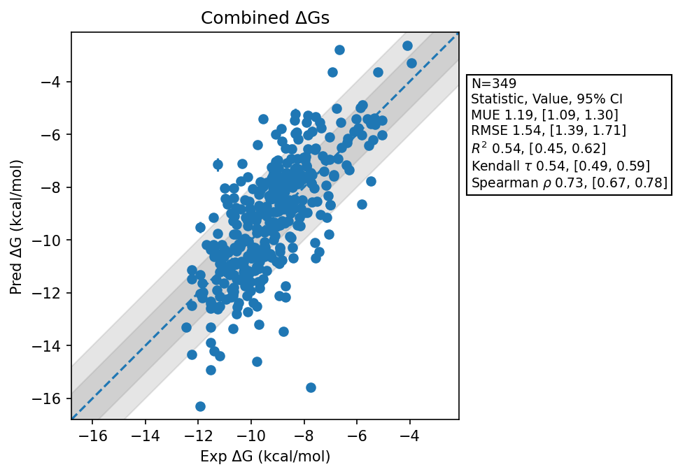

# Summary
- Number of Datasets: 14
- Number of Ligands: 353
- Number of Edges: 607
- Total Wallclock Time: 157.31 Hours
- Average Time Per Edge: 0.26 Hours
- TMD Sha: [d90311ea6b8fd4d5bddae32b2925ef72d57ec45e](https://github.com/tmd-industries/tmd/tree/d90311ea6b8fd4d5bddae32b2925ef72d57ec45e)

## Notes:
- A subset of the datasets run with dynamically sized water boxes (https://github.com/tmd-industries/tmd/pull/94)
