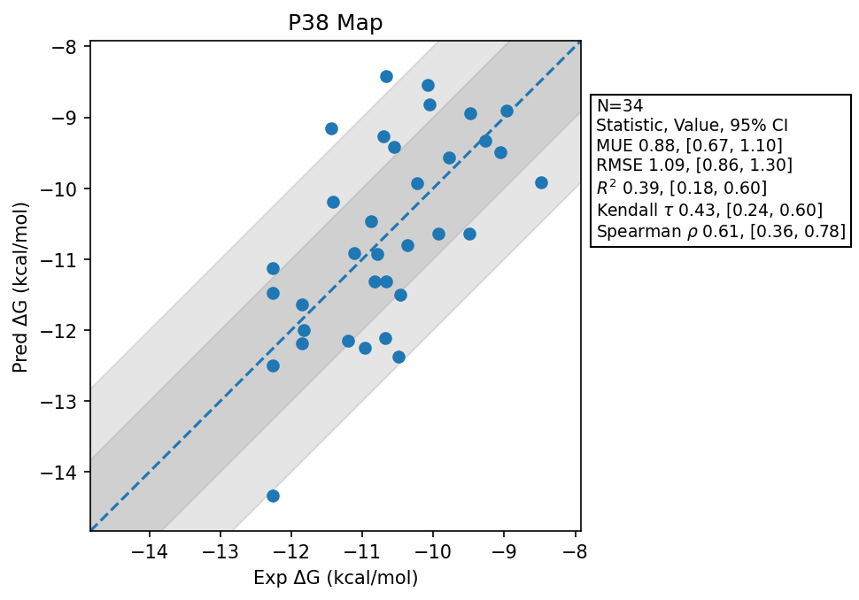

# P38 Map

## Statistics Summary
- MUE: 0.88
- RMSE: 1.09
- R²: 0.39
- Kendall 𝜏: 0.43
- Spearman ρ: 0.61

## System Details
- Ligands: 34
- Host Atoms: 6680
- Map Details:
  - Edges: 60
  - Min Dummy Atoms: 0
  - Max Dummy Atoms: 22
  - Mean Dummy Atoms: 9.6
  - Median Dummy Atoms: 9.5

## Simulation Details
- TMD Sha: [d90311ea6b8fd4d5bddae32b2925ef72d57ec45e](https://github.com/tmd-industries/tmd/tree/d90311ea6b8fd4d5bddae32b2925ef72d57ec45e)
- GPU: RTX 4090
- MPS Processes: 12
- Total Wallclock Time: 16.67 Hours
- Average Time Per Edge: 0.28 Hours
- Total Nanoseconds Simulated: 7186.00
- TMD Forcefield: smirnoff_2_0_0_amber_am1bcc.py
- Ligand Charges: Amber AM1BCC ELF10
- Simulation Details:
  - Seed: 4115
  - Equilibration Steps: 200000
  - Steps Per Frame: 400
  - Production Ns: 2
  - Target Overlap: 0.667
  - Water Sampling: True
  - REST: Temperature Scale 3.0
  - Local MD: Steps 390, Radius 1.2
