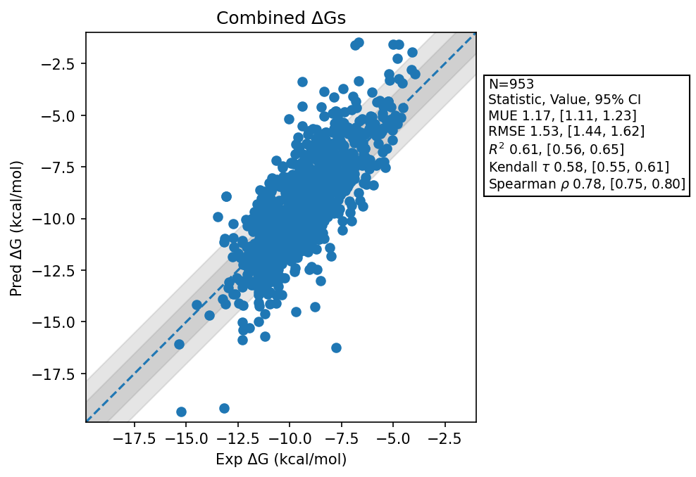

# Summary 
- Number of Datasets: 61
- Number of Ligands: 961
- Number of Edges: 1624
- Total Wallclock Time: 325.30 Hours
- Average Time Per Edge: 0.20 Hours
- TMD Sha: [10dc832c303aa794b47663a4da8d114ca6eea151](https://github.com/tmd-industries/tmd/tree/10dc832c303aa794b47663a4da8d114ca6eea151)

## Description
Running the complete benchmarks, including GPCRs, with the new reaction field change and the improvement to Batched bisection.

