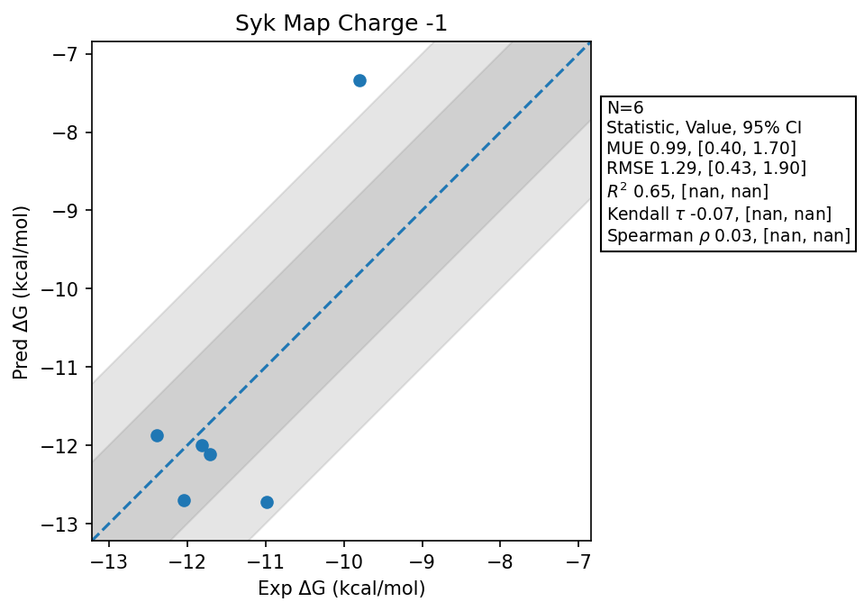

# Syk Map Charge -1

## Statistics Summary
- MUE: 0.99
- RMSE: 1.29
- R²: 0.65
- Kendall 𝜏: -0.07
- Spearman ρ: 0.03

## System Details
- Ligands: 6
- Host Atoms: 4558
- Map Details:
  - Edges: 9
  - Min Dummy Atoms: 4
  - Max Dummy Atoms: 25
  - Mean Dummy Atoms: 13.3
  - Median Dummy Atoms: 11.0

## Simulation Details
- TMD Sha: [10dc832c303aa794b47663a4da8d114ca6eea151](https://github.com/tmd-industries/tmd/tree/10dc832c303aa794b47663a4da8d114ca6eea151)
- GPU: RTX 5090, RTX 50080
- MPS Processes: 2
- Batch Mode: True
- Total Wallclock Time: 1.66 Hours
- Average Time Per Edge: 0.18 Hours
- Total Nanoseconds Simulated: 1654.80
- TMD Forcefield: smirnoff_2_0_0_amber_am1bcc.py
- Ligand Charges: Amber AM1BCC ELF10
- Simulation Details:
  - Seed: 501
  - Equilibration Steps: 200000
  - Steps Per Frame: 400
  - Production Ns: 2
  - Target Overlap: 0.667
  - Water Sampling: True
  - REST: Temperature Scale 3.0
  - Local MD: Steps 390, Radius 1.2
