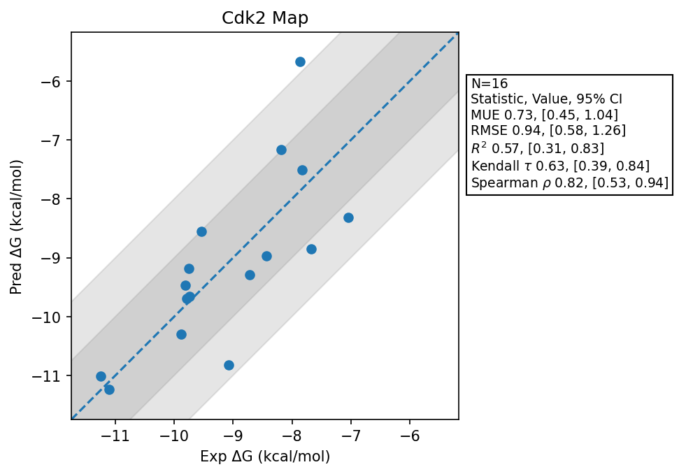

# Cdk2 Map

## Statistics Summary
- MUE: 0.73
- RMSE: 0.94
- R²: 0.57
- Kendall 𝜏: 0.63
- Spearman ρ: 0.82

## System Details
- Ligands: 16
- Host Atoms: 4825
- Map Details:
  - Edges: 29
  - Min Dummy Atoms: 0
  - Max Dummy Atoms: 11
  - Mean Dummy Atoms: 4.5
  - Median Dummy Atoms: 4.0

## Simulation Details
- TMD Sha: [c1f675e11c1e05722eb072dcd5938757baab1a6b](https://github.com/tmd-industries/tmd/tree/c1f675e11c1e05722eb072dcd5938757baab1a6b)
- GPU: RTX 4090
- MPS Processes: 12
- Total Wallclock Time: 7.43 Hours
- Total Nanoseconds Simulated: 3370.40
- TMD Forcefield: smirnoff_2_2_1_amber_am1bcc.py
- Ligand Charges: Amber AM1BCC ELF10
- Simulation Details:
  - Seed: 912
  - Equilibration Steps: 200000
  - Steps Per Frame: 400
  - Production Ns: 2
  - Target Overlap: 0.667
  - Water Sampling: True
  - REST: Temperature Scale 3.0
  - Local MD: Steps 390, Radius 1.2
