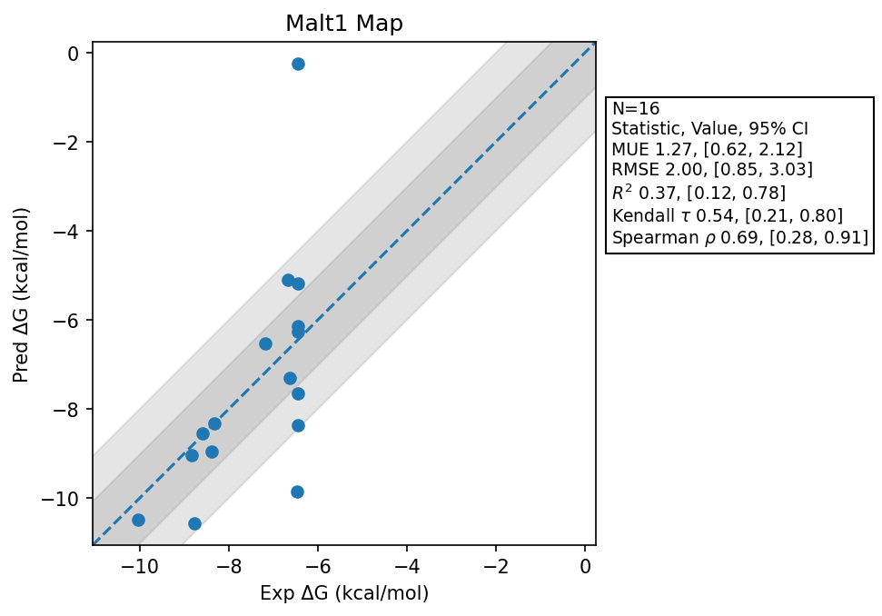

# Malt1 Map

## Statistics Summary
- MUE: 1.27
- RMSE: 2.00
- R²: 0.37
- Kendall 𝜏: 0.54
- Spearman ρ: 0.69

## System Details
- Ligands: 16
- Host Atoms: 6224
- Map Details:
  - Edges: 26
  - Min Dummy Atoms: 1
  - Max Dummy Atoms: 13
  - Mean Dummy Atoms: 6.8
  - Median Dummy Atoms: 7.0

## Simulation Details
- TMD Sha: [c1f675e11c1e05722eb072dcd5938757baab1a6b](https://github.com/tmd-industries/tmd/tree/c1f675e11c1e05722eb072dcd5938757baab1a6b)
- GPU: RTX 5090, RTX 5080
- MPS Processes: 12
- Total Wallclock Time: 3.12 Hours
- Total Nanoseconds Simulated: 2931.60
- TMD Forcefield: smirnoff_2_0_0_amber_am1bcc.py
- Ligand Charges: Amber AM1BCC ELF10
- Simulation Details:
  - Seed: 912
  - Equilibration Steps: 200000
  - Steps Per Frame: 400
  - Production Ns: 2
  - Target Overlap: 0.667
  - Water Sampling: True
  - REST: Temperature Scale 3.0
  - Local MD: Steps 390, Radius 1.2
