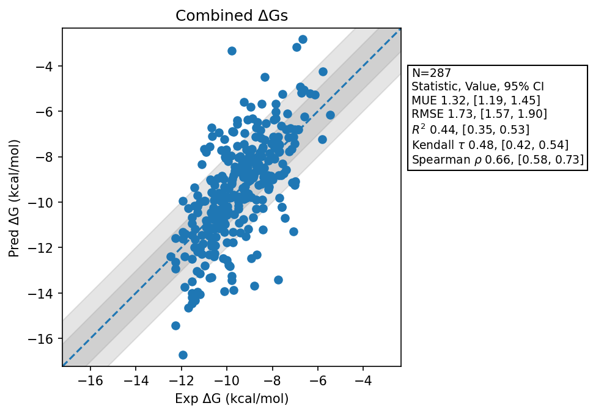

# Summary
- Number of Datasets: 10
- Number of Ligands: 287
- Number of Edges: 499
- Total Wallclock Time: 97.47 Hours
- Average Time Per Edge: 0.20 Hours
- TMD Sha: [4f3643f90aaf86a3e5425a329b8d85e72ffd6bc2](https://github.com/tmd-industries/tmd/tree/4f3643f90aaf86a3e5425a329b8d85e72ffd6bc2)

## Notes:
- Ran with a nonbonded cutoff of 0.9nm, rather than the standard 1.2nm
