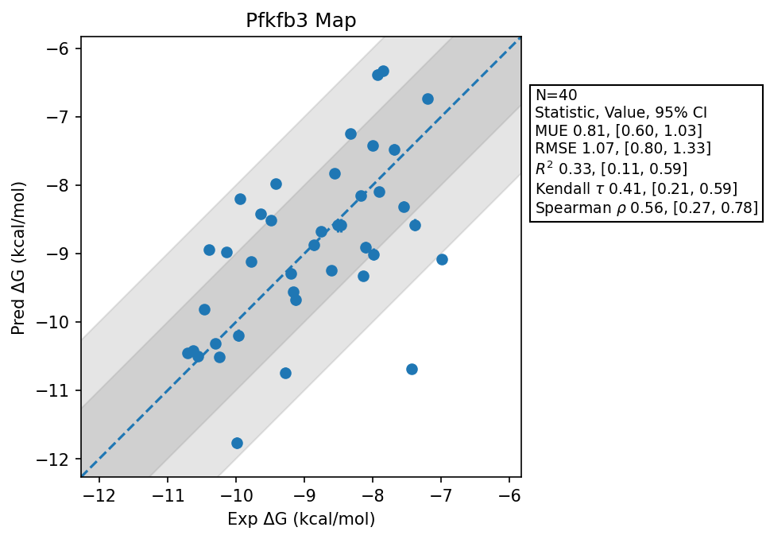

# Pfkfb3 Map

## Statistics Summary
- MUE: 0.81
- RMSE: 1.07
- R²: 0.33
- Kendall 𝜏: 0.41
- Spearman ρ: 0.56

## System Details
- Ligands: 40
- Host Atoms: 8158
- Map Details:
  - Edges: 71
  - Min Dummy Atoms: 0
  - Max Dummy Atoms: 17
  - Mean Dummy Atoms: 4.9
  - Median Dummy Atoms: 5.0

## Simulation Details
- TMD Sha: [4f3643f90aaf86a3e5425a329b8d85e72ffd6bc2](https://github.com/tmd-industries/tmd/tree/4f3643f90aaf86a3e5425a329b8d85e72ffd6bc2)
- GPU: RTX 4090
- MPS Processes: 12
- Total Wallclock Time: 13.51 Hours
- Average Time Per Edge: 0.19 Hours
- Total Nanoseconds Simulated: 7006.80
- TMD Forcefield: smirnoff_2_0_0_amber_am1bcc.py
- Ligand Charges: Amber AM1BCC ELF10
- Simulation Details:
  - Seed: 4115
  - Equilibration Steps: 200000
  - Steps Per Frame: 400
  - Production Ns: 2
  - Target Overlap: 0.667
  - Water Sampling: True
  - REST: Temperature Scale 3.0
  - Local MD: Steps 390, Radius 1.2
