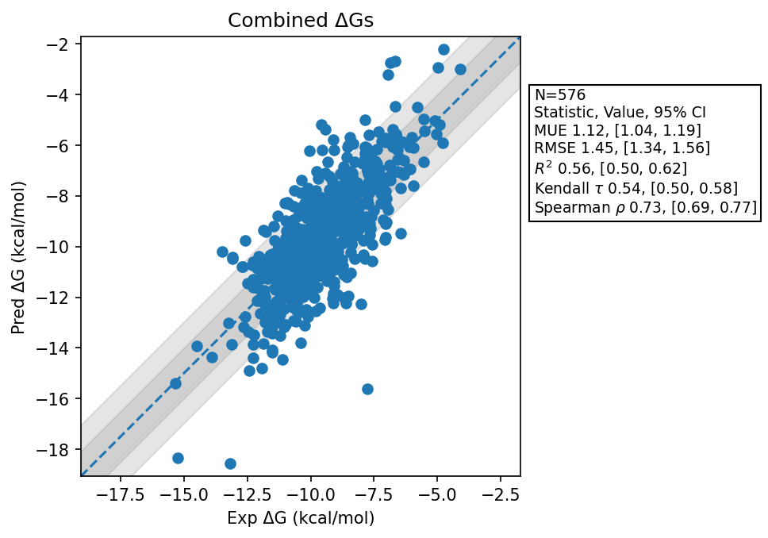

# Summary
- Number of Datasets: 36
- Number of Ligands: 576
- Number of Edges: 974
- Total Wallclock Time: 237.14 Hours
- Average Time Per Edge: 0.24 Hours
- TMD Sha: [be54a617e0ca39fba04baa293394cc65f12327f5](https://github.com/tmd-industries/tmd/tree/be54a617e0ca39fba04baa293394cc65f12327f5)

## Notes:
- Enables Heavy Atom Matches heavy atom in the atom mapper
