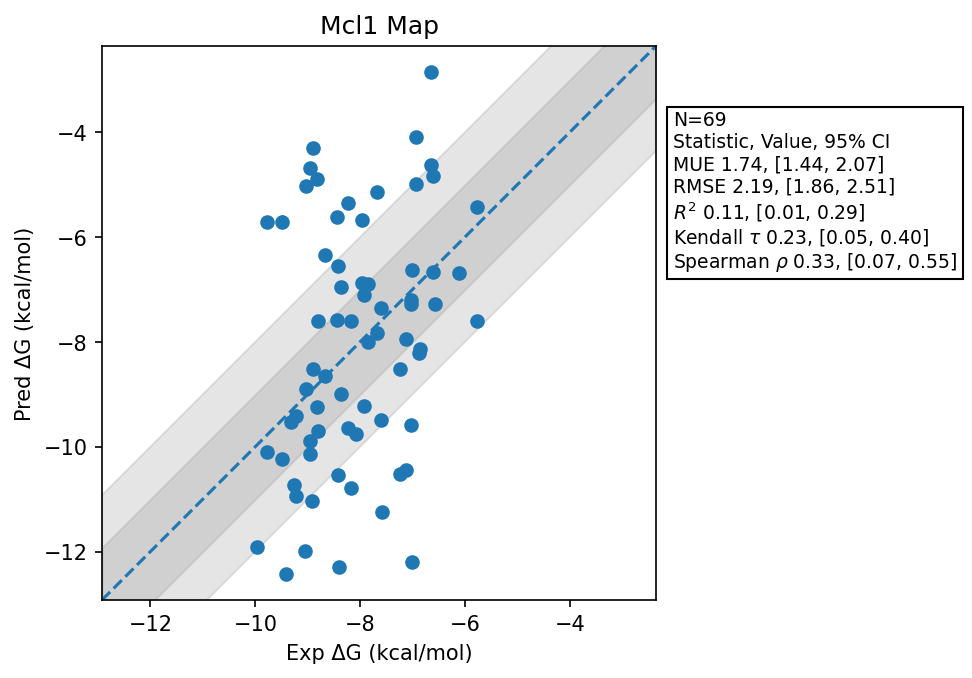

# Mcl1 Map

## Statistics Summary
- MUE: 1.74
- RMSE: 2.19
- R²: 0.11
- Kendall 𝜏: 0.23
- Spearman ρ: 0.33

## System Details
- Ligands: 69
- Host Atoms: 2536
- Map Details:
  - Edges: 129
  - Min Dummy Atoms: 0
  - Max Dummy Atoms: 12
  - Mean Dummy Atoms: 3.3
  - Median Dummy Atoms: 3.0

## Simulation Details
- TMD Sha: [963cb9609cdaf2ee1d8a570c06ea4f70ccede326](https://github.com/tmd-industries/tmd/tree/963cb9609cdaf2ee1d8a570c06ea4f70ccede326)
- GPU: RTX 4090
- MPS Processes: 13
- Total Wallclock Time: 31.44 Hours
- Total Nanoseconds Simulated: 15398.00
- TMD Forcefield: smirnoff_2_2_1_amber_am1bcc.py
- Ligand Charges: Amber AM1BCC ELF10
- Simulation Details:
  - Equilibration Steps: 200000
  - Steps Per Frame: 400
  - Production Ns: 2
  - Target Overlap: 0.667
  - Water Sampling: True
  - REST: Temperature Scale 3.0
  - Local MD: Steps 390, Radius 1.2
